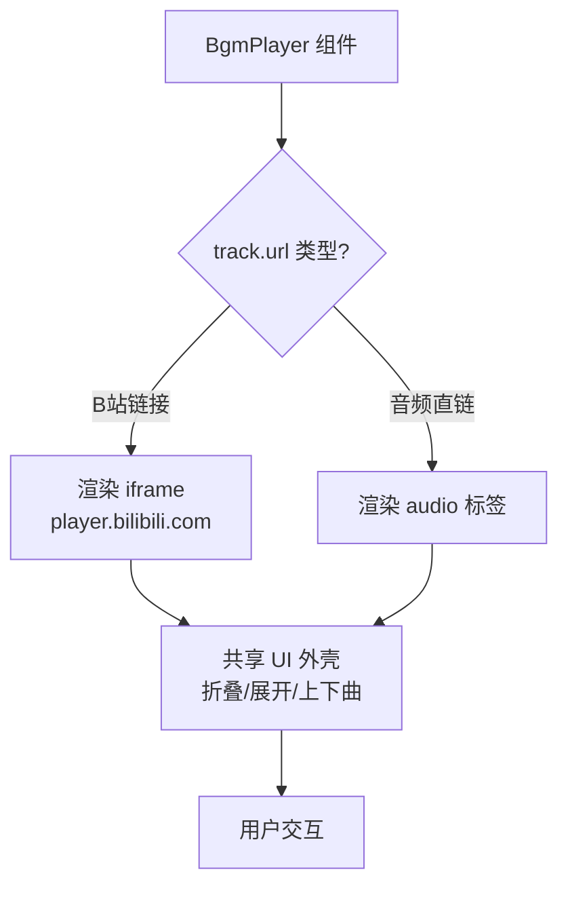

## 用户需求

让博客的 BGM 播放器支持播放 B 站视频。用户在管理后台填入 B 站视频链接（如 `https://www.bilibili.com/video/BV1qb411m7zv/`）后，前台播放器自动识别并以 iframe 方式嵌入 B 站官方播放器，实现视频背景音乐播放。

## 核心功能

- **B 站链接识别**：自动检测用户输入的 URL 是否为 B 站视频链接（`bilibili.com/video/BVxxx` 或 `b23.tv` 短链）
- **iframe 嵌入播放**：对 B 站链接，使用 `//player.bilibili.com/player.html` 官方嵌入播放器代替 `<audio>` 标签
- **音频链接兼容**：原有的音频直链（.mp3/.wav 等）继续使用 `<audio>` 标签播放，不受影响
- **UI 一致性**：播放器折叠/展开交互、控制按钮（上下曲、播放暂停）保持不变
- **管理后台提示更新**：URL 输入框 placeholder 更新为支持 B 站链接和音频链接

## 技术方案

### 实现策略

在现有 `BgmPlayer` 组件中增加 **URL 类型检测** 逻辑：根据 `track.url` 判断是 B 站链接还是普通音频链接，B 站链接渲染 `<iframe>` 播放器，音频链接继续使用 `<audio>` 标签。两种模式共享同一套播放器 UI 外壳（折叠/展开、上下曲切换）。

### 关键技术决策

1. **B 站链接判断**：通过正则匹配 `bilibili.com/video/` 或 `b23.tv` 识别 B 站链接，从 URL 中提取 BV 号
2. **iframe 嵌入格式**：`//player.bilibili.com/player.html?bvid={BV号}&page=1&autoplay=0&danmaku=0`（禁用自动播放和弹幕，适合博客场景）
3. **混合播放模式**：同一个播放列表可以混合 B 站视频和音频文件，切换曲目时自动切换对应的播放方式
4. **最小修改原则**：只修改 `bgm-player.tsx` 组件和 `fuwari-theme-settings.tsx` 的 placeholder 文案，Schema 和数据流不变

### 实现细节

**B 站 BV 号提取逻辑**：

- 从 `https://www.bilibili.com/video/BV1qb411m7zv/` 提取 `BV1qb411m7zv`
- 从 `https://b23.tv/xxxxx` 短链中提取（可能需要处理重定向，简化为直接使用 bvid 参数匹配）
- 使用正则 `/bilibili\.com\/video\/(BV[a-zA-Z0-9]+)/` 匹配

**组件渲染分支**：

```
// 伪代码示意
const isBilibili = /bilibili\.com\/video\/(BV[a-zA-Z0-9]+)/.test(track.url);

if (isBilibili) {
  // 渲染 iframe，隐藏 audio 控制逻辑
  const bvid = track.url.match(/BV[a-zA-Z0-9]+/)?.[0];
  // iframe src: //player.bilibili.com/player.html?bvid={bvid}&page=1&autoplay=0&danmaku=0
} else {
  // 原有 audio 标签逻辑
}
```

**注意点**：

- iframe 模式下，播放/暂停/上下曲按钮仍需正常运作（上下曲切换到下一首，iframe 销毁重建）
- B 站 iframe 没有直接的 play/pause JS API，因此播放按钮在 B 站模式下简化为"展开即开始"，用户通过 iframe 自带控件控制
- 如果列表中有 B 站链接，折叠状态下点击展开后自动渲染 iframe；切换到音频链接时销毁 iframe 创建 audio

### 影响范围

- `src/features/theme/themes/fuwari/components/effects/bgm-player.tsx` — 核心改动
- `src/features/config/components/themes/fuwari-theme-settings.tsx` — placeholder 文案
- Schema、config service、blog.config.ts 均无需改动

### 架构设计

不改动现有架构，仅在 BgmPlayer 组件内部增加 URL 类型判断分支：



### 目录结构

```
src/features/theme/themes/fuwari/components/effects/
└── bgm-player.tsx              # [MODIFY] 增加 B 站链接检测和 iframe 渲染分支

src/features/config/components/themes/
└── fuwari-theme-settings.tsx   # [MODIFY] 更新 URL 输入框 placeholder
```