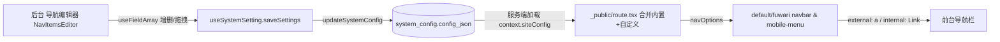

## 用户需求

将个人博客前台导航栏的「自定义栏目」改为可在管理后台配置：支持后台对栏目的**命名与数量**进行增删改，并对栏目进行**拖拽排序**；首页 / 文章 / 友链三个内置栏目保持代码写死，不受后台影响。

## 产品概览

- 前台导航栏在保留三个内置栏目的基础上，额外展示由后台配置的若干自定义栏目。
- 每个自定义栏目可配置：多语言名称（中文 / 英文）、链接类型（站内路由 或 外部 URL）、是否新窗口打开。
- 后台「设置」中新增「导航」管理区块，提供可视化列表编辑与拖拽排序。

## 核心功能

- 后台新增「导航」配置区块：以列表形式展示自定义栏目，支持新增、编辑、删除、拖拽排序。
- 每个栏目支持中英文名称分别输入，外链可填写任意 http(s) 网址并选择新窗口打开。
- 前台导航栏按当前语言显示栏目名称；外链以 `<a target="_blank">` 渲染，站内链接以 `<Link>` 渲染。
- 配置随系统设置统一保存，前台即时生效（无需数据库迁移，配置存于现有 system_config JSON 字段）。

## 技术栈

- 沿用现有栈：React 19 + TypeScript + TanStack Router/Start + Tailwind CSS + react-hook-form + zod + Paraglide i18n + Cloudflare D1（system_config 单 JSON 列）。
- UI 组件复用项目内置 `@/components/ui`（shadcn 风格）与现有 `SectionShell` 卡片样式，不引入新组件库。

## 实现方案

### 总体策略

在现有 `SiteConfig`（存于 `system_config.config_json` 单一 JSON 列）中新增 `navItems` 数组字段，避免新增数据表与迁移文件；后台沿用 `react-hook-form` + `useFieldArray` 的现有编辑范式（`social-links-editor.tsx`）实现增删与拖拽排序；前台 `_public/route.tsx` 把内置三项与 `siteConfig.site.navItems` 合并后下发主题。

### 关键技术决策

1. **数据结构**：`NavItem { id, label:{zh,en}, type:"internal"|"external", to:string, openInNewTab?:boolean }`。`type:"internal"` 校验 `to` 以 `/` 开头；`"external"` 校验为合法 http(s) URL。默认 `navItems: []`，内置三项不入库。
2. **零迁移**：`navItems` 仅是 `config_json` 里的新增可选项，现有 `updateSystemConfig` 经 zod 自动接纳，无 D1 migration。
3. **外链渲染**：扩展 `NavOption` 类型，新增 `external?`、`openInNewTab?`，并把 `to` 放宽为 `string`；navbar/mobile-menu 在 `external` 时用 `<a href target="_blank" rel="noopener noreferrer">`，否则 `<Link to={option.to}>`（`to` 做类型断言以兼容动态路径）。两个主题共 4 个消费文件需同步。
4. **拖拽排序（无新依赖）**：采用原生 HTML5 `draggable` + `onDragStart/onDragOver/onDrop`，调用 `useFieldArray` 的 `move(from,to)` 重排；额外提供上/下移动按钮作为可达性兜底（项目依赖中无 dnd 库，避免引入）。
5. **多语言取值**：前台用 `getLocale()`（`@/paraglide/runtime`）取当前 locale，渲染 `item.label[locale]`，缺省回退 `zh`。

### 性能与可靠性

- 配置读取走现有 `context.siteConfig`（服务端按请求加载，`useSystemSetting` 保存后会 invalidate `CONFIG_KEYS`），无额外查询与 N+1。
- 前台合并为纯前端内存计算（一次 `Array.map`），开销可忽略；不影响现有缓存命中与 CDN 边缘策略。
- 校验集中在 zod schema，提交前由 `zodResolver` 拦截非法路径/URL，避免脏数据入库。

## 实现要点

- 复用 `social-links-editor.tsx` 的 `useFieldArray` 列表范式与 `SectionShell` 卡片样式，保持一致视觉。
- i18n：在 `messages/en.json`、`messages/zh.json` 新增后台导航相关 key（如 `settings_nav_title`、`settings_nav_add`、`settings_nav_type_internal/external`、`settings_nav_label_zh/en`、`settings_nav_url`、`settings_nav_newtab`、`settings_nav_drag_hint`），保存后执行 `bun run i18n:compile` 重新生成类型。
- 前台仅在 `_public/route.tsx`（及 `_user/route.tsx` 用户中心导航）中合并自定义项，内置三项逻辑不变。

## 架构设计



## 目录结构与改动

```
src/features/config/site-config.schema.ts      # [MODIFY] 新增 NavItemSchema 与 NavItemsSchema，并在 SiteConfigInputSchema / SiteConfigSchema 增加可选 navItems 字段（含 internal 以/开头、external 为 http(s) 的 refine 校验）
src/blog.config.ts                             # [MODIFY] 在 blogConfig.site 增加 navItems: [] 默认值
src/features/theme/contract/layouts.ts         # [MODIFY] 扩展 NavOption：to 放宽为 string，新增 external?、openInNewTab? 字段
src/routes/_public/route.tsx                    # [MODIFY] 用 useRouteContext 取 siteConfig，按 getLocale() 把 siteConfig.site.navItems 映射为 navOptions，追加在内置三项之后
src/routes/_user/route.tsx                      # [MODIFY] 用户中心导航同步合并自定义栏目（与 _public 一致）
src/features/theme/themes/default/layouts/navbar.tsx       # [MODIFY] external 渲染 <a>，否则 <Link to={option.to}>，activeProps 仅内部链接生效
src/features/theme/themes/default/layouts/mobile-menu.tsx  # [MODIFY] 同上，支持外链
src/features/theme/themes/fuwari/layouts/navbar.tsx        # [MODIFY] 同上
src/features/theme/themes/fuwari/layouts/mobile-menu.tsx   # [MODIFY] 同上
src/features/config/components/nav-items-editor.tsx        # [NEW] 后台导航编辑器：useFieldArray 列表 + 每 locale 输入框 + type 下拉 + 链接输入 + 新窗口开关 + 拖拽排序 + 增删
src/routes/admin/settings/index.tsx            # [MODIFY] 新增「导航」Tab 与 TabsContent，挂载 NavItemsEditor
messages/en.json / messages/zh.json            # [MODIFY] 新增导航编辑相关 i18n key
```

## 关键结构（参考）

```ts
export const NavItemSchema = z.object({
  id: z.string().min(1),
  label: z.object({ zh: z.string().trim().max(60), en: z.string().trim().max(60) }),
  type: z.enum(["internal", "external"]),
  to: z.string().min(1),
  openInNewTab: z.boolean().optional(),
}).refine(
  (v) => (v.type === "internal" ? v.to.startsWith("/") : /^https?:\/\//.test(v.to)),
  { message: "internal 链接需以 / 开头，external 需为 http(s) URL", path: ["to"] },
);
```

## 设计风格

后台「导航」配置区块沿用现有管理后台的极简编辑风格：以 `SectionShell` 卡片容器承载，标题用衬线字体，标签用等宽大写小字（tracking 较宽），边框为 `border-border/30`、背景 `background/50`，与站点设置页保持完全一致。新增栏目为可拖拽的卡片行，整体克制、留白充足，无多余装饰。

## 页面区块（导航编辑 Tab）

1. **页头区**：标题「导航设置」+ 说明文案（来自 i18n），右侧复用既有保存按钮（由设置页统一处理）。
2. **栏目列表卡片**：每个自定义栏目为一行卡片，左侧为拖拽手柄（GripVertical 图标，HTML5 draggable），右侧为删除按钮。
3. **名称输入区**：并排两个 Input（中文 / 英文），各带语言标签，宽度响应式（移动端纵向堆叠）。
4. **链接配置区**：type 下拉（站内路由 / 外部 URL）+ 链接输入框（占位提示区分 `/posts` 与 `https://...`），外链时显示「新窗口打开」开关。
5. **底部操作**：「+ 添加栏目」按钮（虚线/文字按钮，hover 变前景色），拖拽时行高亮、出现插入指示线。
6. **空状态**：无任何自定义栏目时显示引导文案与添加入口。

## 可用扩展

### Skill

- **Impeccable（前端设计工具集）**
- 用途：在实现 `nav-items-editor.tsx` 后台导航编辑器时，确保拖拽行卡片、空状态、增删交互的视觉细节与现有管理后台风格一致且精致。
- 预期结果：产出与站点设置页视觉统一、微交互流畅（拖拽高亮、hover 过渡）的导航编辑 UI，符合项目现有设计语言。